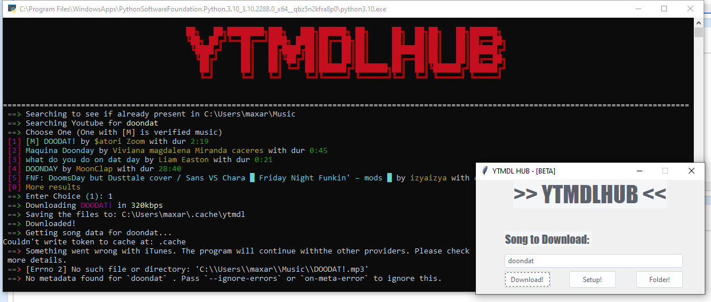

# YTMDLGUI - [BETA]
User-friendly adaptation of [ytmdl](https://github.com/deepjyoti30 "ytmdl") in the form of a little tkinter menu.

[](https://forthebadge.com) [](https://forthebadge.com)


## Installation
Install the 2 libraries using the commands down below, and then just run the code with the .bat file

```python
pip install tk
pip install colored
```


## Compatibility

Should be compatible with all types of OS since it's python, but IDK I need to test it.

🟢 = Yes
🔴 = No
🚧 = In Testing

|  Operative System|  Compatible? |
| :------------: | :------------: |
| Windows |🟢 |
|  Mac |  🚧 |
| Linux  |  🚧 |

## Features

There are very little features but I will implement more as time goes!

- Folder Button
- Setup Button
- More to come!

## TLDR

I AM NOT THE CREATOR OF YTMDL NOR I AM COLABORATING WITH THE CREATOR THIS IS JUST AN ADAPTATION OF THE PROGRAM IF YOU HAVE ANY COMPLAINTS, DOUBTS, ETC YOU CAN CONTACT ME THRU EMAIL AT: [tacomastabusiness@gmail.com](mailto:tacomastabusiness@gmail.com "tacomastabusiness@gmail.com")

## Credits

- [@deepjyoti30](https://github.com/deepjyoti30 "@deepjyoti30") (YTMDL MAKER)
- [@LUXTACO](https://github.com/LUXTACO "@LUXTACO") (GUI MAKER)

## Licence

[MIT](https://github.com/LUXTACO/YTMDLGUI/blob/main/LICENSE "MIT")
